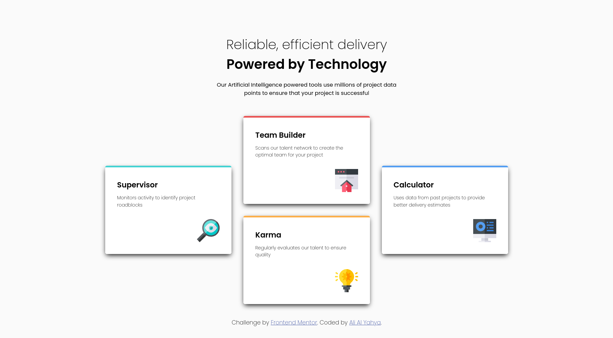

<!-- @format -->

# Frontend Mentor - Four card feature section solution

This is a solution to the [Four card feature section challenge on Frontend Mentor](https://www.frontendmentor.io/challenges/four-card-feature-section-weK1eFYK). Frontend Mentor challenges help you improve your coding skills by building realistic projects.

## Table of contents

- [Overview](#overview)
  - [The challenge](#the-challenge)
  - [Screenshot](#screenshot)
  - [Links](#links)
- [My process](#my-process)
  - [Built with](#built-with)
  - [What I learned](#what-i-learned)
    - [HTML](#leanred--html)
    - [CSS](#learned--css)
  - [Continued development](#continued-development)
    - [HTML](#continued-development--html)
    - [CSS](#continued-development--css)
    - [JS](#continued-developement-js)
  - [Useful resources](#useful-resources)
  - [AI Collaboration](#ai-collaboration)
- [Author](#author)

## Overview

### The challenge

Users should be able to:

- View the optimal layout for the site depending on their device's screen size

### Screenshot



### Links

- [Solution](https://github.com/ayx234/FM-Four_Card_Feature_Section)
- [Live Site](https://ayx234.github.io/FM-Four_Card_Feature_Section)

## My process

### Built with

- Semantic HTML5 markup
- CSS custom properties
- CSS Grid
- Mobile-first workflow

### What I learned

#### Leanred--HTML

- Remembered that icon images need:
  - No text in the alt attribute
  - An empty alt attribute `alt=""`
  - `aria-label="hidden"`

```html

```

#### Learned--CSS

- for properties `justify-content`, `justify-items`, `align-content`, `align-items`:
  - **Justify**: Columns (inline axis (horizontal))
  - **Align**: Rows (block axis (vertical))
  - **Content**: Columns or rows
  - **Items**: Elements or text inside cells (nodes)
- in `repeat()` for `grid-template-[columns|rows]:`
  - 1st argument:
    - `auto-fit`
    - `auto-fill`
  - 2nd argument:
    - `minamax()`
      - 1st arg is frequently in `px` or `rems` etc
      - 2nd arg is frequently in `fr`

```css
.grid {
  grid-template-columns: repeat(auto-fill, minmax(200px, 1fr));
  justify-content ; /* ditributes columns */
}
```

**Note: I did not use this in this project. I just learned it throught reading**

### Continued development

Areas I want to learn more about in Front-end

#### Continued-Development--HTML

- Accessibilty

#### Continued-Development--CSS

- Layouts
- Designing
- Animations
- Accessibilities
- New features and properties

#### Continued-Developement-JS

- Web components
- More in Frameworks such as react and remix

### Useful resources

- [utopia.fyi](https://utopia.fyi/) - Useful for dynamic scaling for font-size and spacing
  - Generates scales for font-size and spacing using clamp()
  - Although the values it gave me did not exactly fit this projects design, it's a good future reference

### AI Collaboration

Describe how you used AI tools (if any) during this project. This helps demonstrate your ability to work effectively with AI assistants.

#### VSCode's Copilot

##### Used Methodology

- Edit mode
- Review the code for accessibility, readability and maintainability

##### Helpfulness

###### Negative

- Most of the suggestions were unfortunately not suiting

###### Positive

- It reminded me that the `alt` attribute for an html icon element should be empty

## Author

- Website - [Ali Al Yahya](https://github.com/ayx234)
- Frontend Mentor - [ayx234](https://www.frontendmentor.io/profile/ayx234)
